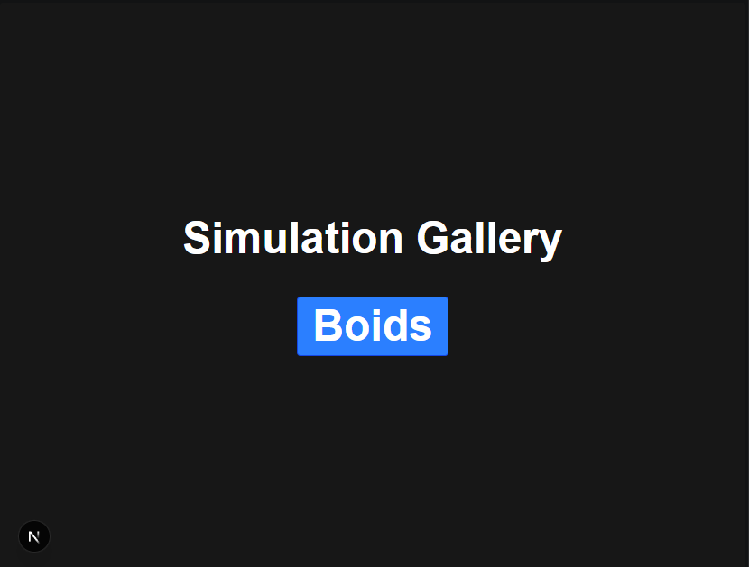
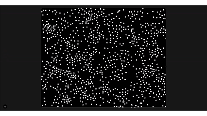

# Boids Simulation

A real-time **Boids flocking simulation** built with TypeScript and rendered in the browser.

The simulation models emergent flocking behaviour by giving each boid a small set of simple rules. When these rules interact, coordinated group behaviour naturally emerges without explicitly controlling the flock as a whole.

## Application

When the application is launched, the user is first presented with the **Simulation Gallery** landing page.



The landing page provides a **Boids** button which redirects the user to the interactive Boids simulation.

```text
Simulation Gallery
        │
        ▼
   [ Boids ]
        │
        ▼
  Boids Simulation
```

This provides a simple gallery structure that can be expanded with additional simulations in the future.

## Demo



## Features

* **Simulation Gallery** — landing page for accessing available simulations.
* **Boids Navigation** — button that redirects the user to the Boids simulation.
* **Separation** — prevents boids from getting too close to one another.
* **Alignment** — encourages boids to match the direction and velocity of nearby boids.
* **Cohesion** — encourages boids to move towards the centre of their local group.
* **Wall Avoidance** — prevents boids from leaving the simulation area.
* **Neighbour Detection** — identifies nearby boids used for calculating flocking behaviour.
* **Real-Time Simulation** — all behaviours are calculated continuously as the simulation runs.

## How It Works

Each boid calculates its movement based on the nearby boids within its perception range.

The resulting steering behaviour is a combination of:

```text
Separation
     +
Alignment
     +
Cohesion
     +
Wall Avoidance
     ↓
Combined Steering Force
     ↓
Updated Velocity
     ↓
Updated Position
```

No individual boid is given instructions about where the flock should move. Instead, complex flocking behaviour emerges from the interaction between simple local rules.

## Project Structure

```text
src/
└── simulations/
    └── Boids/
        ├── behaviours/
        │   ├── alignment.ts
        │   ├── cohesion.ts
        │   ├── seperation.ts
        │   └── wallAvoidance.ts
        ├── engine.ts
        ├── neighbors.ts
        ├── renderer.ts
        ├── settings.ts
        └── types.ts
```

## Technologies

* TypeScript
* React
* Next.js
* HTML Canvas
* Vector-based movement and steering behaviours

## Running Locally

Clone the repository and install the dependencies:

```bash
git clone https://github.com/Trybo-1/Simulation-gallery.git
cd Simulation-gallery
npm install
```

Start the development server:

```bash
npm run dev
```

Then open:

```text
http://localhost:3000
```

## Purpose

This project is part of a collection of simulations exploring **computer science concepts, algorithms, and emergent behaviour** through interactive visualisations.

The goal is to implement the underlying logic from scratch and make the behaviour observable rather than treating the simulation as a black box.
